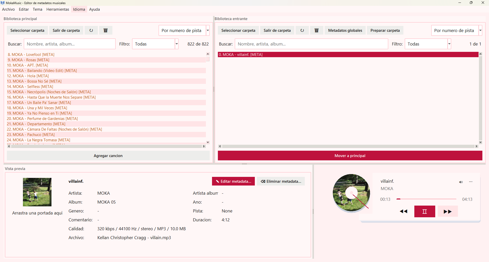

# MokaMusic

<p align="center">
  
</p>

<p align="center">
  <strong>Review, play, clean, organize, and edit local music metadata from a focused desktop app.</strong>
</p>

<p align="center">
  <a href="https://www.python.org/"></a>
  
  
  
</p>

MokaMusic is a desktop app for playlist preparation and local music library maintenance. Work with two folders side by side, fix metadata in batches, reorder tracks, rename files, export reports, and keep backups before important changes.

## Highlights

- Manage main and incoming music folders side by side.
- Edit single-track or batch metadata with before/after previews.
- Prepare playlists by applying track numbers and clean filenames from the visible order.
- Find missing metadata, duplicate tracks, low bitrate files, missing cover art, and possible corrupt files.
- Play tracks inside the app with a redesigned bottom player and cover-art preview.
- Load large libraries faster with unified scanning, cache support, and background loading.
- Support `.mp3`, `.wav`, `.ogg`, `.flac`, `.m4a`, `.aac`, `.opus`, and `.wma`.

## Preview



## Current Status

The project uses a local virtual environment. The old `venv/` folder is no longer needed; use `.venv/` with the Python version installed on your machine.

## Installation

```powershell
python -m venv .venv
.\.venv\Scripts\activate
python -m pip install --upgrade pip
pip install -r requirements.txt
```

If `python` is not available in your PATH, install Python 3.10+ and enable the option to add it to PATH.

## Run From Source

```powershell
python main.py
```

## Windows Executable

The project includes a PyInstaller configuration for building a desktop executable.

```powershell
.\.venv\Scripts\pyinstaller.exe MokaMusic.spec --noconfirm
```

The generated app is placed at:

```text
dist/MokaMusic/MokaMusic.exe
```

Because the current build uses PyInstaller's folder mode, distribute the whole `dist/MokaMusic` folder, not only the `.exe`.

## Main Workflow

1. Open a folder in `Main Library` and, if needed, another one in `Incoming Library`.
2. Select one or more tracks to preview cover art and metadata.
3. Use `Edit metadata...` to edit a single song or selected fields across multiple songs.
4. In `Incoming Library`, use global metadata tools to prepare new music before moving it into the main playlist.
5. Use `Prepare playlist` to number tracks and rename files using a format like `001 - Artist - Title`.
6. Review quality, duplicates, missing cover art, and metadata issues from the `Tools` menu.
7. Play the current selection with the redesigned bottom player, including vinyl-style cover art, progress, volume, and primary controls.
8. Before bulk changes, MokaMusic creates backups that can be restored from `Tools`.

## Prepare Playlist

The playlist workflow is built to avoid manual renumbering and renaming:

1. Load a curated playlist into `Main Library`, or new songs into `Incoming Library`.
2. Arrange the visible order of the tracks.
3. Use `Insert at position...` if you want to move one or more songs into a specific position.
4. Use `Prepare playlist` to apply the full order.

`Prepare playlist` creates a backup, updates `track_number`, renames files, and refreshes the library. The final filename format is:

```text
001 - Artist - Title.mp3
```

If artist or title metadata is missing, MokaMusic tries to infer it from existing filenames such as `Artist - Title.mp3`.

## Core Features

- Two side-by-side libraries: main and incoming.
- Audio support for `.mp3`, `.wav`, `.ogg`, `.flac`, `.m4a`, `.aac`, `.opus`, and `.wma`, with graceful errors when local codecs cannot decode a file.
- Search by filename or metadata, with filters for missing fields, missing cover art, duplicates, and playback status.
- Audio quality filters and sorting for low bitrate, approximate 256 kbps, and 320 kbps or higher.
- Organized track list with multiple selection and manual ordering.
- Drag-and-drop reordering and track numbering based on the current order.
- Playlist preparation with preview: current order, `track_number`, and physical file rename.
- Insert tracks at a specific position and automatically shift the rest.
- Sorting by name, artist, album, track number, duration, audio quality, date, or last played.
- Compact preview panel with cover art, title, artist, album artist, album, year, genre, track number, and comments.
- Single-track editing and batch editing with before/after preview.
- JSON metadata import with preview and selectable fields.
- Export selected tracks, current view JSON, M3U8 playlists, and full library reports.
- Custom cleanup presets for grouping several metadata cleanup actions.
- Metadata clearing modal with selectable fields to preserve.
- Cover art management: drag a JPG or PNG into the preview to save it as `PORTADA.jpg` and apply it to the active song folder.
- Safe moving, adding, renaming, and deleting with recycle-bin support when available.
- Redesigned integrated player with a premium card layout, circular vinyl-style cover, centered play/pause, previous/next controls, secondary controls, minimal progress bar, and volume modal.
- Light/dark themes, visual presets, custom themes, fullscreen mode, font size, and density settings.
- Main menus and informational modals adapt to the active theme, including About, quick guide, shortcuts, diagnostics, and reports.
- Spanish/English UI, system language detection, and missing translation reporting.
- Logs in `mokamusic.log`.

## Quick Cleanup Actions

- Remove `feat`, `ft`, and `featuring`.
- Remove text inside parentheses or brackets.
- Keep only the title.
- Create title from filename.
- Prepare playlist from the visible order.
- Insert songs at a specific position.
- Copy artist to album artist.
- Rename files from metadata.
- Find cover art automatically from the folder.

## Audio And Library Tools

From `Tools`, MokaMusic can inspect and repair larger libraries:

- Quality report with missing metadata, duplicates, low bitrate, and possible file damage.
- Library statistics: total duration, metadata completion, genres, years, top artists, and top albums.
- Library comparison between main and incoming folders to detect new songs or duplicates.
- Playback history with played songs, play counts, and last played date.
- Audio quality analysis with bitrate, duration, format, sample rate, and channels.
- Advanced duplicate detection by metadata, normalized filename, and approximate duration.
- File validation for missing paths, unsupported extensions, and possibly corrupt files.
- Audio conversion presets for MP3 320/256/128 kbps, WAV, and FLAC, with an option to preserve folder structure.

## Organization And Smart Playlists

MokaMusic can also organize files physically, always with preview before applying changes:

- Rename files by template, for example `{track_number:03d} - {artist} - {title}`.
- Organize files into folders with templates like `{artist}/{album}/{track_number:02d} - {title}`.
- Validate playlists to detect repeated songs, missing numbering, and broken paths.
- Generate smart playlists with criteria:
  - `low_bitrate`
  - `unplayed`
  - `missing_cover`
  - `artist:Name`
  - `genre:Genre`
  - `duration:60`

## Appearance

The `Theme` menu lets users personalize MokaMusic:

- Light, dark, and system theme modes.
- Visual presets such as classic, midnight blue, forest, rose, high contrast, and OLED black.
- Save the current appearance as a custom theme.
- Manage custom themes: rename, duplicate, delete, and restore.
- Import and export themes as JSON.
- Adjust accent color, font size, and density.
- Fullscreen mode with `F11`.

## Backups

MokaMusic creates JSON backups before batch metadata changes, cleanup operations, renaming, moving files, or cover art changes. Backups include metadata and cover art when available.

From the `Tools` menu you can use:

- `Backup history`: view date, action, folder, and number of affected songs.
- `Undo last metadata change`: restore the most recent backup from the current session.

## Tests

Compile key modules:

```powershell
.\.venv\Scripts\python.exe -m py_compile main.py app\ui\app.py app\ui\metadata_workflow.py app\ui\theme.py app\services\metadata_editor_service.py app\services\song_info_service.py app\services\playback\audio_player.py
```

Run the full test suite:

```powershell
.\.venv\Scripts\python.exe -m unittest discover -s tests -p "test*.py"
```

## Dependencies

`requirements.txt` is the source of truth:

- `eyed3` and `mutagen` for reading and writing metadata.
- `Pillow` for cover art.
- `pygame` for playback.
- `tkinterdnd2` for drag and drop.
- `Send2Trash` for safe deletion when available.

## Architecture

The project started with flat modules under `app/`. It now uses a layered structure so future improvements are easier to maintain:

```text
app/
  controllers/      Coordination between UI and services
  models/           Shared data, enums, and result objects
  services/         Metadata, backups, cover art, files, audio, and playlist logic
  ui/               Main app and extracted UI workflows
  views/            Tkinter panels and windows
  views/modals/     Editing, preview, backup, report, and appearance modals
  ui_helpers/       Reusable widgets, dialogs, and tooltips
  utils/            Pure helpers for text, audio, and filenames
```
